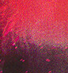

#  Darkflame Universe

See the original README for DarkflameUniverse Liscence / Server Information:                       
[Darkflame Universe README](https://github.com/Fire-Temple/DarkflameServer/blob/main/README_original.md)

## Installation / First time setup

### Requirements

#### 7zip
 - [7zip](https://www.7-zip.org/)

#### Client
You will need the **LEGO Universe - Unreleased Version (Unpacked)** modded client << name may change 

may or may not be on archive.org

**OR** If you already have a client like lcdr unpacked (or majority of unpacked clients)
You may alternatively get           
**LEGO Universe - Unreleased Version (Patch)**  <- for a smaller download (optional)

### Setup

1. Download the latest release for your operating system here: 
	[Releases](https://github.com/Fire-Temple/DarkflameServer/releases)
	
	The release you chose should contain the server files folder with one of these names:
	> ```diff
	> msvc
	> macos
	> gnu-release
	
	
2. Extract the release you downloaded into your LEGO Universe client, You should see the server files folder
   in the same folder as `legouniverse.exe`
   
	You can rename this folder to whatever you wish, as it contains all the code necessary to run the server
   
   
3. Open the server files folder located in your client and double-click `MasterServer.exe`
	You will then be asked to create an account the first time and assign that account a GM level between `0` and `9`
	
	> Higher GM levels will give the account access to certain chat commands:	
	> [In-game commands](https://github.com/Fire-Temple/DarkflameServer/blob/main/docs/Commands.md)
	
	The terminal window should automatically close when it is finished
	
	
4. You can now double-click `MasterServer.exe` again to start up the server and play LEGO Universe

	When shutting down the server, it is highly recommended to click the `MasterServer.exe` window 
	then hold `ctrl` while pressing `c` to stop the server.
	
	
### Additional notes	
	
* To create a new account or alter an exsisting one, open a command window in the server files folder
	and run `MasterServer.exe -a`
	
	> with git bash, the command would be: 
	> `./MasterServer.exe -a`


* In the server files folder, `worldconfig.ini`	contains some in-game settings you might find useful

	> Frostburgh, solo racing, etc.
	
<br>

## Building server from source code (Alternative)

**Everything below this point is intended for older dlu users or those who prefer to build from source**


**If you know what you're doing** and have setup a DLU server before, follow the same steps from whatever guide you used before                   
with the exception of the points below:

* **When requested to run** `git clone --recursive ...`                       
  **Run this instead:** `git clone --recursive https://github.com/fire-temple/DarkflameServer`
  
* **When using a client, only use** `LEGO Universe - Unreleased Version (Unpacked)`                               
  **OR Get an unpacked client that includes** `LEGO Universe - Unreleased Version (Patch)`

<br>

### If this is your first time building Darkflame Universe from source

Setup a DarkflameUniverse server first, then come back to migrate your DLU Server using the guide further down                               
[DLU Repository](https://github.com/DarkflameUniverse/DarkflameServer)            
**LEGO Universe Community Hub** can also offer support setting up DarkflameUniverse              
[LUCH Discord](https://discord.gg/TW4fXd75uD)

<br>

## Migrating your existing server

### If you want to update your existing DLU Server for Fire Temple

**Follow this guide** to migrate the server code to this fork, and setup your client for use:

[Fire Temple Migration Guide](https://gist.github.com/Dimes6003/412591fdc7e96cd147456f30ac8a1f9e)
